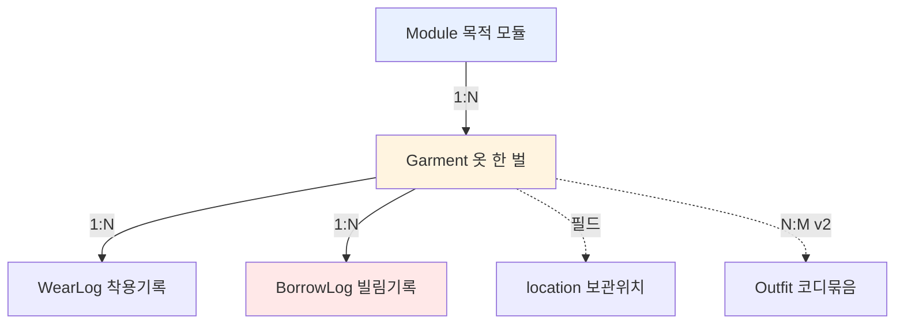

# TIDY — 구조 설계 (Structure)

> 메커니즘·알고리즘 이전에 **무엇을 다루고, 어떻게 조직할지**를 정하는 뼈대 문서.
> 대상: **개인 1명 전용** 의류 관리 시스템 (멀티유저·권한·공유 개념 없음).
> 상위 전제: [`03-module-concept.md`](03-module-concept.md) — **목적 모듈 + 배타성 + A안**.
> 버전: **v0.2** (2026-07-06) — 카테고리 주축 → **목적 모듈 주축**으로 재정렬.

---

## 0. 설계 원칙
1. **단순함 우선** — 나 한 명만 쓰므로 계정/권한/동기화/공유 계층 전부 제거.
2. **목적 모듈이 1차 축** — 옷은 "무엇에 쓰는가(목적)"로 먼저 나눈다.
3. **목적 불혼용(배타성)** — 옷 1벌은 모듈 1개에만 속한다. (`INV-1`)
4. **계절은 모듈 내부 속성** — 계절로 모듈을 가르지 않는다. (`INV-2`)
5. **입력 최소화** — 자동 추론 우선, 사람은 보정만.
6. **저장 축 ≠ 분석 축** — 저장은 모듈별, 분석은 전역 뷰로 분리(단점 C5·C8 대책).

---

## 1. 구조 개요 (3층)

```
┌──────────────────────────────────────────────────────┐
│  1. 도메인 구조   무엇이 존재하는가 (엔티티/관계)            │
├──────────────────────────────────────────────────────┤
│  2. 정보 구조     목적 모듈로 담고, 모듈 내부로 정리한다       │
├──────────────────────────────────────────────────────┤
│  3. 저장 구조     실제로 어디에 어떻게 담는가                 │
└──────────────────────────────────────────────────────┘
   그 위에서 01-design 의 메커니즘·알고리즘이 동작
```

---

## 2. 도메인 구조 — 엔티티와 관계

핵심 1개(Garment) + 보조 4개. **`Module`이 최상위 조직 단위**, `BorrowLog`가 배타성의 안전장치.



| 엔티티 | 역할 | 개인 전용 단순화 |
|---|---|---|
| **Module** | 목적 단위 미니 옷장 (7개 고정, §3.1) | 소유자 개념 없음 |
| **Garment** | 옷 한 벌. 정확히 1개 모듈에 귀속 (`INV-1`) | 모든 속성의 주체 |
| **WearLog** | 착용 이벤트 `{garmentId, date}` | append-only |
| **BorrowLog** | **다른 모듈에서 빌려 입은 기록** `{garmentId, forModule, date}` | 오버랩 안전장치(대책 C1·C6) |
| **Location** | 실제 보관 위치 | 지금은 Garment 문자열 필드 |
| **Outfit** | 코디 묶음 | **v2 확장** — 자리만 |

> 관계: `Module 1—N Garment`, `Garment 1—N WearLog`, `Garment 1—N BorrowLog`.

---

## 3. 정보 구조 — "목적으로 담고, 내부로 정리하고, 전역으로 본다"

### 3.1 1차 축 = 목적 모듈 (7개 고정)
```
1 유니폼        회사용
2 등산          아웃도어
3 운동          헬스·러닝
4 정장          격식 있는 자리
5 주말 외출     캐주얼 외출
6 홈웨어        집·라운지
7 이너/언더웨어  모든 모듈의 공유 베이스 레이어
```
- 옷은 등록 시 **정확히 하나**의 모듈에 귀속(`INV-1`).
- 모듈 추가 기준: *고유한 활동 맥락 + 전용 옷 세트 + 통째로 꺼내는 단위*일 때만(대책 C3).

### 3.2 2차 축 = 모듈 내부 정리 (역할 × 계절)
각 모듈은 자기 안에서 완결된다. 내부는 **역할(role)** 과 **계절(season)** 로만 정리.
```
역할(role)   상의 · 하의 · 아우터 · 신발 · 이너 · 가방 · 액세서리 · 원피스
계절(season) 봄 · 여름 · 가을 · 겨울 · 사철   ← 모듈을 가로지르지 않음(INV-2)
```
예) `등산 모듈 > 상의 > 겨울` = 겨울 등산 상의들.
"반팔"은 축이 아니라 그냥 `운동 모듈 > 상의 > 여름` 안의 한 아이템(§03 원칙2).

### 3.3 보조 축 = 모듈 내부 검색 facet
모듈 안에서 좁힐 때 쓰는 태그성 속성 (전역 분류축 아님).
```
· 색상   팔레트 15색 (주 + 보조)
· 상태   NEW / GOOD / WORN / DAMAGED / RETIRE
· 빈도   착용횟수·최근성 (계산값)
```
> **격식(TPO)은 대부분 모듈에 흡수**되어 별도 축으로 두지 않는다(정장=격식↑, 홈웨어=격식↓).

### 3.4 전역 뷰 (저장 축 ≠ 분석 축)
저장·정리는 모듈별이지만, **모듈을 걷어낸 전체 관점**을 별도로 계산해 제공(대책 C5·C8).
```
전역 리포트 예시
· 색상 분포:   전체에서 검정 상의 몇 벌? (중복 보유 점검)
· 데드스톡:    모듈 불문 1년+ 미착용 목록 (비활성 모듈 사각지대 해소)
· 빌림 히트맵: 어떤 옷이 어느 모듈로 자주 빌려가나 (전용옷 부족 신호)
```

### 3.5 구조 한 줄 요약
```
담기:  목적 모듈 1개        (INV-1, 배타)
정리:  모듈 내부 = 역할 × 계절  (INV-2, 계절 내부화)
찾기:  모듈 안 facet (색상·상태·빈도)
보기:  전역 뷰 (모듈 횡단 분석)
지키기: 빌림 로그 (배타성 예외를 관측)
```

---

## 4. 저장 구조 — 어디에 어떻게 담나

개인·소규모이므로 파일 기반으로 충분. DB는 과함.

```
TIDY/
├── 00-structure.md          # (이 문서) 구조
├── 01-design.md             # 데이터 모델·메커니즘·알고리즘
├── 03-module-concept.md     # 상위 전제 (목적 모듈)
├── data/
│   ├── modules.json         # 7개 모듈 정의 (이름·설명·물리위치)
│   ├── inventory.json       # Garment 목록 (각자 module 필드 보유)
│   ├── wearlog.jsonl        # 착용 기록 (append-only)
│   ├── borrowlog.jsonl      # 빌림 기록 (append-only, 안전장치)
│   └── taxonomy.json        # 세분류·색상 동의어 사전
└── (후속) prototype/
```

**선택 이유**
- `modules.json`: 모듈은 7개로 고정적 → 작은 정의 파일.
- `inventory.json`: 옷마다 `module` 필드 → 통째로 읽어 모듈별/전역 양쪽으로 필터.
- `wearlog` / `borrowlog`: 이벤트는 계속 쌓이므로 append-only 라인 포맷 → 통계·전역뷰에 유리.

---

## 5. 이 구조에서 각 동작이 앉는 자리
```
등록      → inventory.json 에 Garment 추가 (module 배정 필수, role·season 추론)
착용기록  → wearlog.jsonl 한 줄 append
빌림기록  → borrowlog.jsonl 한 줄 append (다른 모듈 용도로 입었을 때)
모듈검색  → module 하드필터 → 역할×계절 → facet 스코어링
전역보기  → inventory + wearlog + borrowlog 조인 → 모듈 횡단 리포트
정리판단  → 활용도 계산 + 데드스톡 + 빌림 히트맵 → 제안
```

---

## 6. 불변식 (Invariants)
- `INV-1` 옷 1벌 → 모듈 1개 (공유 없음).
- `INV-2` 계절/이너 여부는 모듈 **내부** 속성. 상위 분류축 아님.
- `INV-3` 같은 형태(반팔)라도 목적이 다르면 다른 아이템으로 등록.
- `INV-4` 다른 모듈 용도로 착용 시 반드시 BorrowLog 기록 (배타성을 깨지 않고 관측).
- 추론으로 채운 필드는 `unconfirmed` 유지 → 사용자 보정 시 해제.

---

## 7. 열린 질문 / 다음 단계
- [ ] 물리 보관 위치를 모듈에 1:1로 배정할지 (권장: 모듈=서랍/행거 구역).
- [ ] `Outfit`(코디 묶음) 도입 시점 → v2.
- [x] 카테고리 → 역할로 강등, 목적 모듈을 1차 축으로 (v0.2 반영 완료).
- **다음**: `01-design.md` 를 이 구조에 맞춰 정렬(완료 예정) → 시드 데이터로 검증 → 프로토타입.

---
*파일: `TIDY/00-structure.md` · 상위: 03-module-concept, 하위: 01-design.*
