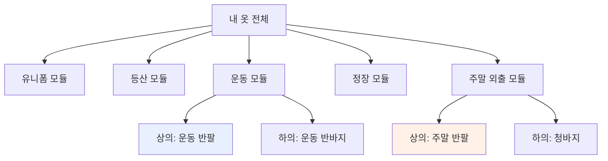

# TIDY — 모듈 개념 검토 (목적 기반 분류)

> 큰 뼈대 이전에 확정하는 **작은 핵심 결정** 하나: "옷을 목적으로 나누고, 목적을 섞지 않는다".
> 이 문서가 이후 구조(00)·설계(01)의 상위 전제가 된다.
> 버전: v0.1 (2026-07-06)

---

## 0. 당신이 정한 두 원칙 (검토 대상)

> **원칙 1. 목적(purpose)에 따라 옷을 구분·정리한다.**
> 예: 유니폼(회사) · 등산복 · 운동복 · 정장 · 주말 외출복 …
>
> **원칙 2. 목적을 섞지 않는다.**
> 가장 혼란스러운 반팔의 경우, 목적이나 계절(이너 용도)에 따라 혼용하지 않는다.

이 두 원칙을 "모듈화"로 부른다. → **하나의 목적 = 하나의 독립된 미니 옷장(모듈).**

---

## 1. 핵심 개념 정의

### 모듈(Module) = 목적으로 닫힌 미니 옷장


- 각 모듈은 **자기 안에서 완결**된다 (그 목적에 필요한 상/하의·아우터·신발이 그 안에 다 있음).
- 옷 한 벌은 **정확히 하나의 모듈**에만 속한다 (원칙 2 = 배타성).
- "운동 반팔"과 "주말 반팔"은 **서로 다른 옷**이며 서로 다른 모듈에 산다.

---

## 2. 원칙 1 검토 — 목적 기반 분류

### 왜 좋은가 (근거)
1. **꺼내는 방식과 일치**: 사람은 "상의를 꺼내야지"가 아니라 *"오늘 등산 가야지"* → 등산 모듈로 간다. 실제 행동 단위와 분류 단위가 같다.
2. **결정 피로 감소**: 한 모듈 안의 옷은 이미 "그 상황에 맞는 것"만 있으므로 고를 후보가 줄어든다.
3. **물리 정리와 매핑 쉬움**: 서랍/행거를 목적별로 배정하면 논리=물리가 일치.
4. **독립 관리 가능**: 모듈 단위로 "이 목적에 뭐가 부족한가"를 감사(audit)할 수 있다. (진짜 모듈화의 이점)

### 일반적 분류(카테고리 우선)와의 차이
| | 카테고리 우선 | **목적(모듈) 우선** |
|---|---|---|
| 1차 축 | 상의/하의/아우터 | 유니폼/등산/운동/정장/주말 |
| 옷 찾기 | "여름 상의 중에…" | "등산 갈 건데…" |
| 반팔 | 한 곳에 모임 → 용도 섞임 | 모듈마다 따로 → 안 섞임 |
| 적합성 | 매장·범용 앱에 적합 | **개인 생활 패턴에 적합** |

→ 개인 1명, 생활 맥락이 뚜렷할수록 목적 우선이 유리. **채택 타당.**

---

## 3. 원칙 2 검토 — 목적 불혼용(배타성)

### 반팔 문제를 어떻게 푸는가
문제의 본질: 반팔은 *카테고리(상의)·계절(여름)·용도(이너)* 세 축에 동시에 걸쳐 **어디에 둘지 모호**하다.

**해결(모듈 규칙)**: 반팔을 "반팔"이라는 공통 그룹으로 묶지 않는다.
```
❌ (혼용)  반팔 서랍 ── 운동용?  이너용?  주말용?  → 매번 헷갈림
✅ (모듈)  운동 모듈 → 여름 상의 = 그 운동 반팔
          주말 모듈 → 여름 상의 = 그 주말 반팔
          정장 모듈 → 이너      = 그 이너용 반팔/반팔티
```
- "반팔"은 **분류 축이 아니다.** 그냥 각 모듈 안의 한 아이템일 뿐.
- 그래서 *"내 반팔 어디 있지?"* 라는 질문 자체가 사라진다 → *"운동 여름 상의"* 로 바뀐다.
- **계절은 모듈을 가로지르지 않고, 모듈 내부 속성**이 된다. (이게 핵심 재구성)

### 파생 불변식 (Invariant)
```
INV-1  옷 1벌 → 모듈 1개  (다대일. 공유 없음)
INV-2  계절/이너 여부는 "모듈 내부" 속성이지, 상위 분류축이 아니다
INV-3  같은 형태(반팔)라도 목적이 다르면 다른 아이템으로 등록
```

---

## 4. 이 결정에서 반드시 짚을 트레이드오프 ⚠️

배타성(원칙 2)의 유일한 비용: **진짜로 여러 목적에 쓰는 옷(오버랩)**.
예: 검정 무지 반팔을 운동에도, 주말에도 입는다. 코트를 회사에도, 주말에도 입는다.

배타성을 지키려면 이걸 규칙으로 정해야 한다. 3가지 선택지:

| 방식 | 내용 | 성격 |
|---|---|---|
| **A. 대표 목적 1개로 귀속** | 가장 자주 쓰는 목적에 배정, 가끔 "빌려 입음" | 단순·권장 |
| **B. 공용 모듈 신설** | `공용/베이스` 모듈을 하나 두고 걸침 옷만 모음 | 배타성 예외 인정 |
| **C. 사실상 2벌로 취급** | 두 목적 다 필요하면 각각 1벌씩 보유 | 원칙에 가장 충실, 비용↑ |

> **권장: A (대표 목적 귀속) + 오버랩이 잦으면 그건 "그 목적에 옷이 부족하다"는 신호로 읽기.**
> B는 목적 불혼용 원칙을 흐리므로 지양. C는 정장 이너 같은 소모품엔 맞음.

> ✅ **확정: A안 채택.** 옷은 대표 목적 1개에 귀속. 다른 목적에 필요하면 "빌려 입기"로 처리하되,
> 빌림이 잦으면 *그 목적에 전용 옷이 부족하다는 신호*로 기록한다(§8-대책 참조).

---

## 5. 이 결정에서 나오는 "작은 규칙들" (확정본)

1. **홈(home) 배정**: 등록 시 옷은 반드시 하나의 모듈에 배정한다.
2. **모듈 내부 구조**: 모듈 안은 `역할(상의/하의/아우터/신발/이너/액세서리) × 계절`로만 정리.
3. **계절은 내부 속성**: 계절로 모듈을 나누지 않는다 (겨울 등산 ⊂ 등산 모듈).
4. **같은 형태 다른 목적 = 다른 옷**: 반팔이라도 목적이 다르면 별도 등록.
5. **오버랩 처리**: §4에서 고른 규칙을 일관 적용.

---

## 6. 이 위에 세워질 "뼈대" 미리보기 (방향 전환)

이 결정으로 앞 문서(00/01)의 축이 뒤집힌다:

```
[이전 뼈대]  카테고리(주축) + 계절·색상·격식·상태(facet)
                    ↓ 전환
[새 뼈대]    목적 모듈(주축)
              └ 모듈 내부: 역할 × 계절
              └ facet(색상·상태·착용빈도)는 "모듈 안에서" 보조 검색
```

- **1차 분류 = 목적 모듈** (구조 §3의 "담는 축"이 카테고리 → 목적으로 교체)
- **역할(상의/하의…)은 2차** (모듈 내부 정리 단위로 강등)
- **격식(TPO)은 대부분 모듈에 흡수됨** (정장 모듈=격식 높음, 운동 모듈=낮음) → 별도 축 불필요할 수 있음
- 저장 구조: 옷 레코드에 `module` 필드가 최상위 키가 됨

> 이 미리보기가 OK면, 다음 단계에서 00-structure / 01-design 을 이 축으로 다시 정렬합니다.

---

## 7. 확정된 결정 ✅

1. **오버랩 처리 규칙** → **A안 (대표 목적 귀속)** 채택.
2. **초기 모듈 목록** → 아래 7개로 확정:

| # | 모듈 | 목적/맥락 | 성격 |
|---|---|---|---|
| 1 | **유니폼** | 회사용 | 활동 목적 |
| 2 | **등산** | 등산·아웃도어 | 활동 목적 |
| 3 | **운동** | 헬스·러닝 등 | 활동 목적 |
| 4 | **정장** | 격식 있는 자리 | 활동 목적 |
| 5 | **주말 외출** | 캐주얼 외출 | 활동 목적 |
| 6 | **홈웨어** | 집·라운지 | 활동 목적 |
| 7 | **이너/언더웨어** | 모든 모듈의 속옷·베이스 레이어 | **공유 베이스** |

> **참고 — 7번의 특수성**: 이너/언더웨어는 사실 "활동 목적"이 아니라 *모든 모듈 아래에 깔리는 공유 베이스*다.
> 오히려 그래서 별도 모듈로 두는 게 맞다(어느 목적에도 종속되지 않는 공용 재고 풀).
> 단, "정장 이너 반팔"처럼 특정 목적에 전용인 이너는 그 목적 모듈에 두어도 된다(§4-C 예외 허용).

---

## 8. 현재 원칙의 장단점 종합 검토

지금 확정된 원칙 = **목적 모듈(주축) + 배타성(1옷 1모듈) + A안(대표 귀속) + 위 7개 모듈**.

### 8.1 장점

| # | 장점 | 설명 |
|---|---|---|
| P1 | **행동 단위와 일치** | "등산 가야지" → 등산 모듈 하나만 보면 됨. 분류=행동. |
| P2 | **결정 피로 최소화** | 모듈 안엔 이미 그 상황용만 있음 → 고를 후보가 적음. |
| P3 | **반팔/계절 혼란 제거** | 계절이 모듈 내부 속성이 되어 "반팔 어디?" 문제 소멸. |
| P4 | **격식(TPO) 자동 흡수** | 정장=격식↑, 홈웨어=격식↓. 별도 격식 축 거의 불필요. |
| P5 | **모듈 단위 감사** | "등산 모듈에 겨울 상의 없음" 같은 **부족분**을 목적별로 진단. |
| P6 | **패킹/준비가 쉬움** | 여행·활동 시 해당 모듈만 통째로 챙기면 됨. |
| P7 | **물리=논리 매핑** | 서랍/행거를 모듈에 배정하면 정리와 데이터가 일치. |
| P8 | **생활 변화에 강함** | 취미가 생기면 모듈 추가, 없어지면 모듈 통째 정리. |

### 8.2 단점·리스크 (냉정하게)

| # | 단점/리스크 | 왜 문제인가 |
|---|---|---|
| C1 | **오버랩 세금** | A안이라도 공용 옷(무지 반팔·코트)은 한 모듈에 살고 나머지엔 "빌림" 발생 → 실제론 배타성이 깨지는 순간이 생김. |
| C2 | **중복 보유 유발** | 배타성을 지키려면 목적마다 비슷한 옷을 각각 소유 경향 → 총량↑, 비용·공간↑ (정리 목표와 상충 가능). |
| C3 | **경계 모호 / 모듈 난립** | "주말 외출 vs 데이트 vs 경조사"처럼 목적 경계가 흐릿하면 어디 넣을지 또 고민 → 모듈이 계속 늘 위험. |
| C4 | **등록 시 판단 강제** | 새 옷마다 "어느 모듈?" 결정 필요. 범용 베이직(흰 티·검정 양말)은 배정이 자의적. |
| C5 | **범모듈 조회 약화** | "내 흰 상의 총 몇 개?", "전체에서 가장 안 입는 옷"처럼 모듈을 가로지르는 분석·색상 코디가 어려워짐. |
| C6 | **아우터/신발/가방의 교차성** | 상·하의보다 아우터·신발·가방이 목적을 더 자주 넘나듦 → C1이 이 카테고리에서 집중 발생. |
| C7 | **개념 이음새** | 최상위에 '활동 목적'(등산)과 '옷 역할'(이너)이 섞임 → 완전히 균질한 축은 아님(실용상 감수). |
| C8 | **비활성 모듈의 사각지대** | 정장처럼 가끔 쓰는 모듈은 재고가 방치돼도 티가 안 남 → 전체 과잉을 가림. |
| C9 | **초기 마이그레이션 비용** | 기존 옷장을 모듈로 재편하는 1회성 작업 부담. |

### 8.3 단점별 대책 (설계로 흡수)

| 리스크 | 대책 |
|---|---|
| C1, C6 | **빌림 로그**: 다른 모듈에서 빌려 입으면 카운트. 임계치 초과 시 "그 목적에 전용 옷 추가" 또는 "그 옷을 공용 취급" **제안**. 아우터·신발은 처음부터 빌림이 잦다고 보고 대표 모듈만 지정. |
| C2 | **중복 경보**: 같은 역할×계절 옷이 여러 모듈에 유사하게 있으면 알림 → 통합 여부 판단. |
| C3 | **모듈 정의 기준 명문화**: "고유한 활동 맥락 + 전용 옷 세트를 가지며 + 통째로 꺼내는 단위"일 때만 모듈. 아니면 기존 모듈의 하위 태그로. |
| C4 | **기본 귀속 규칙**: 애매하면 *가장 자주 입는 목적*에 배정(A안). 정말 범용이면 이너/언더웨어(공유 베이스)나 홈웨어로. |
| C5, C8 | **전역 뷰 별도 제공**: 저장은 모듈별이되, 조회는 모듈을 걷어낸 **전체 관점(색상·빈도·상태)** 리포트를 함께 계산. 저장 축과 분석 축을 분리. |
| C9 | **점진 등록**: 한 번에 다 넣지 않고, 자주 쓰는 모듈부터. 미배정 옷은 `inbox`에 임시 보관 후 차차 배정. |

### 8.4 종합 판정
- **적합**: 생활 맥락이 뚜렷한 개인 1명에게 목적 모듈은 **직관·효율 면에서 우수**(P1~P8).
- **핵심 약점 2개**: (1) 오버랩/교차 아이템(C1·C6), (2) 전역 가시성 저하(C5·C8).
- 둘 다 **설계로 완화 가능** — "빌림 로그"와 "전역 뷰 분리"가 핵심 안전장치.
- 결론: **원칙 유지 채택**. 단, 위 두 안전장치를 뼈대에 반드시 포함할 것.

---
*파일: `TIDY/03-module-concept.md` · 결정 확정 완료. 다음: 00/01 를 목적 모듈 축으로 재정렬.*
