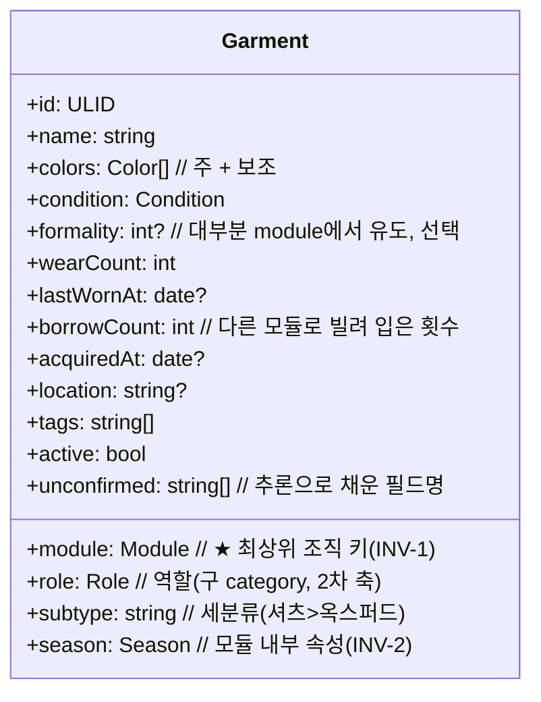

# TIDY — 데이터 모델 · 메커니즘 · 알고리즘

> `00-structure.md`의 뼈대 위에서 동작하는 상세 설계.
> 상위 전제: 목적 모듈 + 배타성 + A안 (`03-module-concept.md`).
> 버전: **v0.2** (2026-07-06) — 목적 모듈 축으로 재정렬.

---

## 1. 데이터 모델

### 1.1 모듈 (`Module`) — 7개 목적 모듈 + 1개 스테이징
```
UNIFORM   유니폼(회사)   HIKING  등산       WORKOUT  운동
SUIT      정장           WEEKEND 주말 외출   HOMEWEAR 홈웨어
INNER     이너/언더웨어 (공유 베이스)
────────────────────────────────────────────────
INBOX     인박스 (스테이징) — 미배정 임시함, 목적 모듈 아님
```

#### 1.1b 인박스(`INBOX`) — 미배정 임시함
집에 있는 옷을 **일단 담아 두고 어느 모듈로 갈지 검토**하는 스테이징 영역. 목적 모듈이 아니다.
- **목표 수량 없음**(target 미포함) · 총 103벌 집계에 안 들어감.
- 워크플로: `등록 → INBOX → 검토` → ① **모듈 배정**(맞으면) ② **처분**(안 맞거나 불필요) ③ 보류(계속 INBOX).
- 배정 시 배타성(`INV-1`) 그대로 적용 — 정확히 1개 목적 모듈로 이동.
- INBOX 체류가 길면(예: 90일+) "결정 필요" 넛지.
| 필드 | 타입 | 설명 |
| --- | --- | --- |
| `id` | enum | 위 7개 |
| `name` | string | 표시 이름 |
| `location` | string | 물리 보관 구역 (예: "안방 3번 서랍") |

### 1.2 의류 아이템 (`Garment`)


| 필드 | 필수 | 비고 |
| --- | --- | --- |
| `module` | ✅ | **최상위 키.** 정확히 1개 (`INV-1`) |
| `role` | ✅ | 2차 정리축 (§1.3) |
| `season` | ✅ | 모듈 내부 속성. 소재/두께로 추론 |
| `colors` | ✅ | 최소 1개(주 색상) |
| `condition` | ✅ | 기본 `NEW` |
| `formality` |  | **대개 module에서 유도** → 생략 가능 |
| `borrowCount` |  | 오버랩 관측치 |

### 1.3 역할 (`Role`) — 구 category, 이제 모듈 **내부** 2차 축
```
TOP 상의 · BOTTOM 하의 · OUTER 아우터 · SHOES 신발
INNER 이너 · BAG 가방 · ACCESSORY 액세서리 · ONEPIECE 원피스
```

### 1.4 계절 (`Season`) — 모듈 내부 속성 (`INV-2`)
```
SPRING · SUMMER · FALL · WINTER · ALL_SEASON
```

### 1.5 색상 (`Color`) — 팔레트 15색
```
무채색 WHITE GRAY BLACK
유채색 RED ORANGE YELLOW GREEN TEAL BLUE NAVY PURPLE PINK BROWN BEIGE KHAKI
```
주 색상 1 + 보조 0~n. 코디 확장 위해 hue 각도 매핑 유지.

### 1.6 상태 (`Condition`)
```
NEW 새것 · GOOD 양호 · WORN 사용감 · DAMAGED 손상 · RETIRE 처분후보
```

### 1.7b 날씨 능력 (`weather`, 선택 다중) — 제3의 직교 축
계절(온도)과 별개로, 옷이 특정 **날씨 조건**에 대응하는 능력. 목적도 계절도 아닌 **속성 태그**.
```
RAIN       방수·발수 (하드쉘, 방수 신발, 발수 팬츠)
WIND       방풍 (셸, 바람막이)
COLD       보온 (기모·패딩·다운)
HOT_HUMID  쿨·흡습속건 (여름 기능성)
```
- **모듈·계절 축을 늘리지 않는다** — "우천용 모듈"이나 "비 계절"은 만들지 않음(비는 목적을 가로지르고, 온도대가 아님).
- 목표 수량(target)에 **슬롯을 추가하지 않는다** — 속성이지 칸이 아니므로 수량 불변.
- 코디는 **질의로 해결**: "비 오는 날" = 오늘 모듈 + 계절 + `weather ∋ RAIN` 필터.
- **순수 날씨 장비**(우산·우비·레인부츠)는 신발 공용 풀처럼 **모듈 교차 공용 풀**로 둔다(03 C6 예외).

### 1.7 격식 (`formality`, 선택 1–5)
대부분 모듈이 결정하므로 기본은 module에서 유도. 예외(정장 모듈 안에서 세미포멀 구분 등)만 명시.
```
module → formality 기본값
  SUIT=5  UNIFORM=3  WEEKEND=3  HIKING=2  WORKOUT=2  HOMEWEAR=1  INNER=1
  (UNIFORM=3: IT업계·복장 규정 없음, 반팔·반바지 착용 → 스마트캐주얼 수준)
```

---

## 2. 메커니즘 개요

```
[등록]→[모듈배정+정규화]→ inventory
                              │
        ┌───────────┬─────────┴────────┬────────────┐
   [모듈검색]   [착용/빌림기록]     [전역뷰]      [정리판단]
```

| 메커니즘 | 입력 | 출력 | 알고리즘 |
| --- | --- | --- | --- |
| 등록 | 부분 입력 | Garment | 모듈배정 §3.1, 추론 §3.2~3.4 |
| 모듈검색 | 모듈+상황 | 후보 목록 | 스코어링 §3.5 |
| 착용/빌림 | 이벤트 | 로그 갱신 | §3.6 |
| 전역뷰 | 인벤토리 | 횡단 리포트 | §3.7 |
| 정리판단 | 스냅샷 | 정리 제안 | 활용도 §3.8 |

---

## 3. 알고리즘 정의

### 3.1 등록 — 모듈 배정 (핵심)
`INV-1` 준수: 옷은 반드시 정확히 1개 모듈에 귀속.
```
function register(input):
    g = new Garment(input)
    if g.module is null:
        g.module = suggestModule(g)     # §3.1.1 (추론, unconfirmed 표시)
    g.role    ??= inferRole(g)          # 이름/세분류에서
    g.season  ??= inferSeason(g)        # §3.3
    g.colors    = normalizeColors(...)  # §3.4
    g.condition ??= NEW
    g.formality ??= FORMALITY_BY_MODULE[g.module]   # 유도
    g.active = true
    return g
```

#### 3.1.1 모듈 추론·배정 (`suggestModule`)
자유 텍스트/맥락 신호 → 모듈. **애매하면 A안**(가장 자주 입을 목적) 또는 사용자 선택.
```
신호 → 모듈
  "회사/근무/유니폼"                → UNIFORM
  "등산/트레킹/아웃도어/고어텍스"    → HIKING
  "헬스/러닝/짐/트레이닝"           → WORKOUT
  "정장/수트/예복/셔츠(드레스)"      → SUIT
  "주말/데이트/캐주얼/나들이"        → WEEKEND
  "잠옷/집/라운지/실내"             → HOMEWEAR
  "속옷/이너/내복/양말/베이스"       → INNER

규칙:
  1. 신호 매칭 1개 → 그 모듈
  2. 다중 매칭(오버랩) → A안: 가장 자주 입을 목적 1개 선택 요청
  3. 무매칭 → inbox(미배정)로 두고 나중에 배정 (점진 등록, 대책 C9)
```

### 3.2 역할 추론 (`inferRole`)
세분류/이름 키워드 매핑. (셔츠·티→TOP, 팬츠·청바지→BOTTOM, 자켓·코트→OUTER, 운동화·구두→SHOES …) 무매칭 시 사용자 지정.

### 3.3 계절 추론 (`inferSeason`) — 모듈 내부값
```
린넨·반팔·반바지·메시           → SUMMER
기모·패딩·울코트·두꺼운 니트     → WINTER
가디건·트렌치·얇은 니트          → SPRING+FALL
기본(면티·데님 등)              → ALL_SEASON
사용자 명시 시 항상 우선
```
> 주의: 계절은 모듈을 넘지 않는다(`INV-2`). "겨울 등산 상의"는 HIKING 모듈의 WINTER일 뿐.

#### 3.3.1 계절 혼용 규칙 — "커버리지 카운팅"
모듈(목적)은 **배타적**이지만, 계절은 **연속형(온도 범위)**이라 혼용을 허용한다. 단 "정체성을 바꾸지 않는 범위"에서만.

```
· SUMMER / WINTER / SHOULDER  = 해당 계절 "전용"
     → 그 계절 목표 칸만 채운다.
     → (여름 반팔은 여름 칸만. 겨울 이너로 轉用 금지 ❌)
· ALL_SEASON (사철)           = "유연 필러"
     → 같은 역할의 계절 칸 중 부족한 곳(gap)을 유동적으로 채운다.
       (allseason 목표 칸이 있으면 거기 먼저 채우고, 남는 것만 필러로)
```

- 이 규칙이 (1) 예전 "미배정" 버그를 해소하고, (2) **특정 계절 옷을 다른 계절 용도로 전용하는 것을 구조적으로 금지**한다 (SUMMER 태그는 여름 칸으로만 흐름).
- 커버 범위 밖 **억지 혼용**(두꺼운 겨울옷을 여름에 등)은 금지. 다른 계절 용도가 진짜 필요하면 **별도 아이템**으로 등록 (예: 겨울 레이어링 이너 = `INNER` 모듈의 이너셔츠/내복).
- 세 줄 요약: **① 모듈은 안 섞는다 ② 계절은 커버 범위 안에서만 섞는다(ALL_SEASON만 유동) ③ 계절 전용 옷의 타 계절 轉用 금지.**

### 3.4 색상 정규화 (`normalizeColors`)
```
HEX/RGB → HSL:
  saturation<15% → light 기준 WHITE/GRAY/BLACK
  그 외          → hue 최근접 유채색
문자열 → 동의어 사전(taxonomy.json): "곤색/남색"→NAVY, "먹색"→BLACK, "카키"→KHAKI …
결과: [0]=주 색상, 나머지=보조
```

### 3.5 모듈 내 검색 스코어링 (`search`)
질의는 **먼저 모듈을 고른 뒤** 그 안에서 좁힌다.
```
질의 예: { module: HIKING, season: WINTER, role: TOP, exclude: RETIRE }

1) 하드 필터:
   - g.module == q.module          # 모듈은 1차 필터 (배타성 활용)
   - active == true
   - condition ∉ exclude (기본 RETIRE 제외)
   - role/season 일치 (지정 시, season은 ALL_SEASON 포함)

2) 소프트 스코어 (0~100):
   score =  w1 * conditionScore     # NEW1.0 GOOD0.8 WORN0.5 DAMAGED0.2
          + w2 * freshness          # 오래 안 입을수록 ↑ (로테이션)
          + w3 * seasonExactBonus   # ALL_SEASON보다 정확 일치 가산
   기본 w = (0.5, 0.3, 0.2)   # 격식은 모듈에 흡수 → 가중치 불필요

3) score 내림차순 반환
freshness = min(1, daysSinceLastWorn / 30)
```
> 격식 축이 빠져 이전(§구버전)보다 스코어가 단순해짐 — 모듈이 이미 TPO를 고정하기 때문.

### 3.6 착용 & 빌림 기록
```
function logWear(g, date):        # 자기 모듈 용도로 입음
    g.wearCount += 1; g.lastWornAt = date
    append wearlog {g.id, date}

function logBorrow(g, forModule, date):   # 다른 모듈 용도로 입음 (INV-4)
    assert forModule != g.module
    g.borrowCount += 1
    append borrowlog {g.id, forModule, date}
    # 임계치 제안 (대책 C1·C6):
    if borrowsTo(g, forModule) >= 3 in last 90d:
        suggest("‘{forModule}’용으로 자주 빌림 → 전용 옷 추가 또는 이 옷을 {forModule}로 이동 검토")
```
상태 강등은 자동하지 않고 제안만(오탐 방지): `wearCount % 30 == 0 && GOOD → "WORN 점검?"`.

### 3.7 전역 뷰 (`globalReport`) — 저장축≠분석축 (대책 C5·C8)
모듈을 걷어내고 전체를 본다.
```
· colorDistribution : 역할별·색상별 개수 집계 → 중복 보유 경보
    if 같은 (role, 유사색상) 이 2개 이상 모듈에 존재 → "중복 가능" 플래그
· deadstock         : 모듈 불문 daysSinceLastWorn > 365 목록
    (계절 아이템은 비수기 경과분 제외하고 계산)
· borrowHeatmap     : (fromGarment.module → forModule) 빈도 → 전용옷 부족 진단
· moduleBalance     : 모듈별 (역할×계절) 커버리지 → 부족/과잉 칸 표시
```

### 3.8 정리 판단 — 활용도 점수 (`utilityScore`)
```
utilityScore(g) = wearFrequency * recencyWeight * conditionWeight
  wearFrequency  = wearCount / monthsOwned
  recencyWeight  = exp(-daysSinceLastWorn / 90)      # 계절 아이템은 비수기 제외
  conditionWeight= NEW1 GOOD1 WORN0.7 DAMAGED0.4 RETIRE0.1

판정 (모듈 내부 + 전역 교차):
  하위 20% AND 미착용 > 365일 → 정리 후보
    ├ DAMAGED            → 수선 제안
    ├ NEW/GOOD           → 기부/판매 제안 (멀쩡한데 안 입음)
    └ WORN/RETIRE        → 처분 제안
  + 전역 중복 경보(3.7)에 걸린 옷은 정리 우선순위 가산
```

### 3.9 모듈 밸런스 감사 (`auditModule`)
모듈화의 최대 장점(P5) 실현: 목적별 부족분 진단.
```
for each module:
  grid = role × season 매트릭스
  빈 칸 or 1벌뿐 → "부족" (예: HIKING/OUTER/WINTER 없음)
  과밀 칸        → "과잉"
  borrowHeatmap 상위 → "전용옷 필요" (A안 신호)
```

---

## 4. 불변식 / 검증 (Invariants)
- `INV-1` `module` 필수, 정확히 1개.
- `INV-2` `season`은 모듈 **내부**값(모듈을 가르지 않음). 혼용은 **커버리지 규칙**(§3.3.1)을 따른다: `SUMMER/WINTER/SHOULDER`는 해당 계절 전용, `ALL_SEASON`만 계절 gap을 유동으로 채움. 계절 전용 옷의 **타 계절 轉用 금지**(여름 반팔 → 겨울 이너 ❌).
- `INV-3` 같은 형태·다른 목적 = 별도 아이템.
- `INV-4` 타 모듈 용도 착용 → BorrowLog 필수.
- `colors` ≥ 1. `condition==RETIRE` → `active=false` 권장.
- 추론 필드는 `unconfirmed`에 기록 → 보정 시 제거.

---

## 5. 다음 단계
1. **시드 데이터** — 각 모듈에 샘플 옷 몇 벌로 `inventory.json` 작성 → 검색/전역뷰/감사 검증.
2. **taxonomy.json** — 내 세분류·색상 동의어 채우기.
3. **동작 프로토타입** — §3 알고리즘 구현 (모듈검색 → 전역뷰 → 정리판단 순).
4. **코디(Outfit) 확장** — v2.

---
*파일: `TIDY/01-design.md` · 상위: 00-structure, 03-module-concept.*
